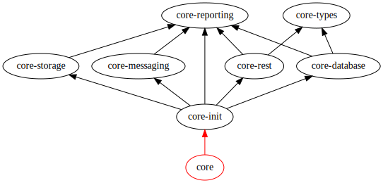

----

Notice: the master branch is for development work on the **upcoming
2.0 release**, which is still unstable. Any changes to a previous
version of core should be developed against master and then
cherry-picked onto the [1.x
branch](https://github.com/drivergroup/driver-core/tree/1.x).

----
[](https://travis-ci.com/drivergroup/driver-core)

# Driver Core Library for Scala Services

Multi-cloud utilities and application initialization framework.

This library offers many common utilities for building applications
that run in multiple environments, including Google Cloud, Ali Cloud,
and of course on development machines.

## Highlights

- Cloud agnostic.

- Sensible defaults. *Applications that use the initialization
  framework can run out-of-the box on cloud or locally, with minimal
  config required.*

- Distributed tracing built into all major utilities. *Significant
  actions are logged and reported automatically to an OpenTrace
  aggregator.*

- Extensible. *Utilities are built to be used standalone. A
  trait-based initialization framework provides utility instances for
  common use-cases.*

## Overview

### Components

This project is split into multiple submodules, each providing
specific functionality.

Project          | Description
-----------------|------------
`core`           | *(deprecated)* Previous application initialization framework.
`core-database`  | Utilities for working with databases, slick in particular.
`core-init`      | Mini-framework that offers default instances of many utilities, configured for the current platform.
`core-messaging` | Library for abstracting over message buses such as Google PubSub.
`core-reporting` | Combined tracing and logging library.
`core-rest`      | Abstractions to represent RESTful services, discovery and client implementations.
`core-storage`   | Object storage utilities.
`core-types`     | Type definitions that are commonly used by applications.
`core-util`      | Other utilities that do not belong anywhere else. **Note that this is a staging place for code that does not have its own submodule yet. Do not depend on it externally!**

These components and their internal dependencies can be represented
with the following graph.



### Dependency

All components are published together under the same version ([latest
version](https://github.com/drivergroup/driver-core/releases)).
```sbt
libraryDependencies += "xyz.driver" %% "core-<component>" % "<version>"
```

### External dependencies

This project has quite a few external dependencies. See
[build.sbt](build.sbt) for a list of them. Some notable Scala
libraries used are:

- [akka-http](https://doc.akka.io/docs/akka-http/current/)
- [akka-stream](https://doc.akka.io/docs/akka/current/stream/)
- [enumeratum](https://github.com/lloydmeta/enumeratum#enumeratum------)
- [scala-async](https://github.com/scala/scala-async)
- [slick](http://slick.lightbend.com/)
- [spray-json](https://github.com/spray/spray-json)
- [sttp](https://github.com/softwaremill/sttp)

## Example Usage

*TODO*

## Building

This project uses [sbt](https://www.scala-sbt.org/) as build tool. It
has grown organically over time, but all new code should follow the
best practices outlined
[here](https://style.driver.engineering/scala.html).

It is set up to automatically build, test, and publish a release when
a Git tag is pushed that matches the regular expression
`v[0-9].*`. Hence, to publish a new version "1.2.3", simply create a
tag "v1.2.3" and `git push --tags` to origin.

## Copying
Copyright 2016-2018 Driver Inc. Released under the Apache License,
Version 2.0.
